# interplanetary-album-box

Welcome to Interplanetary Album, a decentralized Album is waiting for your.

<!-- TOC -->

- [1. Introduction](#1-introduction)
    - [1.1. Elliptic Curve Integrated Encryption Scheme (ECIES)](#11-elliptic-curve-integrated-encryption-scheme-ecies)
    - [1.2. Ontology Distributed Identity Framework (ONTID)](#12-ontology-distributed-identity-framework-ontid)
    - [1.3. InterPlanetary File System (IPFS)](#13-interplanetary-file-system-ipfs)
        - [1.3.1. How IPFS Works](#131-how-ipfs-works)
        - [1.3.2. IPFS HTTP API](#132-ipfs-http-api)
- [2. Architecture](#2-architecture)
- [3. Setting up the environment](#3-setting-up-the-environment)
- [4. Getting started](#4-getting-started)
    - [4.1. what's the Punica Suite](#41-whats-the-punica-suite)
    - [4.2. what's the Punica Box](#42-whats-the-punica-box)
    - [4.3. Unboxing the dApp](#43-unboxing-the-dapp)
    - [4.4. Initialize your IPFS Repository](#44-initialize-your-ipfs-repository)
    - [4.5. Create your Private IPFS Network (optional)](#45-create-your-private-ipfs-network-optional)
    - [4.6. Run your IPFS Node](#46-run-your-ipfs-node)
    - [4.7. Run your dApp](#47-run-your-dapp)
- [5. Use your dApp](#5-use-your-dapp)
    - [5.1. Unlock your Identity](#51-unlock-your-identity)
    - [5.2. Enjoy your Photos](#52-enjoy-your-photos)
    - [5.3. Upload your Photos](#53-upload-your-photos)
    - [5.4. dApp Settings](#54-dapp-settings)

<!-- /TOC -->

## 1. Introduction

### 1.1. Elliptic Curve Integrated Encryption Scheme (ECIES)

Elliptic Curve Integrated Encryption Scheme(also ECIES), is a hybrid encryption system proposed by Victor Shoup in 2001. Shoup's submission can be found at [here](https://www.shoup.net/papers/iso-2_1.pdf).

### 1.2. Ontology Distributed Identity Framework (ONTID)

Ontology DID (also called ONT ID) is a decentralized identity identification protocol based on W3C DID specifications. ONT ID establishes a cryptographically-based digital identity for each entity, allowing self-sovereign of data authorization and ownership confirmation, which makes the identity and data truly assets that the user can control.

If you are interested in ONTID, you can find a detailed introduction [here](https://ontio.github.io/documentation/ontology_DID_en.html).

### 1.3. InterPlanetary File System (IPFS)

InterPlanetary File System (IPFS) is a protocol and network designed to create a content-addressable, peer-to-peer method of storing and sharing hypermedia in a distributed file system.

#### 1.3.1. How IPFS Works

You may be interested about how IPFS works. In fact, when we add files to IPFS:

- Each file and all of the blocks within it are given a unique fingerprint called a cryptographic hash.
- IPFS removes duplications across the network.
- Each network node stores only content it is interested in, and some indexing information that helps figure out who is storing what.
- When looking up files, you're asking the network to find nodes storing the content behind a unique hash.
- Every file can be found by human-readable names using a decentralized naming system called IPNS.

#### 1.3.2. IPFS HTTP API

When an IPFS node is running as a daemon, it exposes an HTTP API that allows you to control the node and run the same commands you can from the command line.

In many cases, using this API this is preferable to embedding IPFS directly in your program — it allows you to maintain peer connections that are longer lived than your app and you can keep a single IPFS node running instead of several if your app can be launched multiple times. In fact, the ipfs CLI commands use this API when operating in online mode.

This API is intended to be the same across different IPFS implementations. However, not all implementations are equally up-to-date. The most feature-complete (and the current reference for this specification) is go-ipfs.

## 2. Architecture

<div align=center></div>

## 3. Setting up the environment

There are a few technical requirements before we start. Please install the following:

- [python 3.7](https://www.python.org/downloads/release/python-370/)
- [git](https://git-scm.com/)
- [go-ipfs](https://dist.ipfs.io/#go-ipfs)

## 4. Getting started

### 4.1. what's the Punica Suite

Punica is a Ontology dApp Development Framework, which has (almost) everything you need for Ontology dApp development.

Now, we have Punica CLI, Punica Box and Solo Chain in our Punica Suite. More powerful dApp development tools is on the road.


### 4.2. what's the Punica Box

In the past, when we wanted to begin developing on Ontology Blockchain, the first question we may ask is, "Where do I start?".

Now, we have a brief answer, “Start from Punica Box.

Punica Box is an example Ontology application and/or boilerplate that puts complimentary tools and libraries into a single, easily-downloadable package. Every Punica Box comes with libraries and tools already preinstalled, code that uses those libraries and tools, external scripts (if necessary), as well as helpful README's and documentation. All Punica Boxes are directly integrated into the OBox command line, and you need only type `punica unbox <box name>` to download and prepare your box of choice.

Before we begin a wonderful journey, ensure you've installed the latest version of OBox before opening your first box.

### 4.3. Unboxing the dApp

Install Punica.

```shell
pip install punica
```

Download the interplanetary-album box.

```shell
punica unbox interplanetary-album
```

Create virtual environments (optional).

```shell
virtualenv --no-site-packages venv
```

If you choose to create a virtual environment, you may need to activate your project's virtual environment.

```shell
.\venv\scripts\activate
```

Install the necessary dependencies.

```shell
pip install -r requirements.txt
```

### 4.4. Initialize your IPFS Repository

`IPFS` stores all its settings and internal data in a directory called the repository. Before using IPFS for the first time, you’ll need to initialize the repository with the ipfs init command:

```shell
PS C:\Users> ipfs init
initializing IPFS node at C:\Users\.ipfs
generating 2048-bit RSA keypair...done
peer identity: QmbhtBLaPLLUXgon7Quue1JkLjRmoQmm97cqto9JdJ4KuR
to get started, enter:

        ipfs cat /ipfs/QmS4ustL54uo8FzR9455qaxZwuMiUhyvMcX9Ba8nUH4uVv/readme
```

The hash after `peer identity` is your node’s ID and will be different from the one shown in the above output. Other nodes on the network use it to find and connect to you. You can run ipfs id at any time to get it again if you need it.

### 4.5. Create your Private IPFS Network (optional)

The IPFS bootstrap list is a list of peers with which the IPFS daemon learns about other peers on the network. IPFS comes with a default list of trusted peers, but you are free to modify the list to suit your needs. One popular use for a custom bootstrap list is to create a personal IPFS network. You can get you IPFS bootstrap list by `bootstrap` command.

```shell
PS C:\Users> ipfs bootstrap
/dnsaddr/bootstrap.libp2p.io/ipfs/QmNnooDu7bfjPFoTZYxMNLWUQJyrVwtbZg5gBMjTezGAJN
/dnsaddr/bootstrap.libp2p.io/ipfs/QmQCU2EcMqAqQPR2i9bChDtGNJchTbq5TbXJJ16u19uLTa
/dnsaddr/bootstrap.libp2p.io/ipfs/QmbLHAnMoJPWSCR5Zhtx6BHJX9KiKNN6tpvbUcqanj75Nb
/dnsaddr/bootstrap.libp2p.io/ipfs/QmcZf59bWwK5XFi76CZX8cbJ4BhTzzA3gU1ZjYZcYW3dwt
/ip4/104.131.131.82/tcp/4001/ipfs/QmaCpDMGvV2BGHeYERUEnRQAwe3N8SzbUtfsmvsqQLuvuJ
/ip4/104.236.179.241/tcp/4001/ipfs/QmSoLPppuBtQSGwKDZT2M73ULpjvfd3aZ6ha4oFGL1KrGM
/ip4/104.236.76.40/tcp/4001/ipfs/QmSoLV4Bbm51jM9C4gDYZQ9Cy3U6aXMJDAbzgu2fzaDs64
/ip4/128.199.219.111/tcp/4001/ipfs/QmSoLSafTMBsPKadTEgaXctDQVcqN88CNLHXMkTNwMKPnu
/ip4/178.62.158.247/tcp/4001/ipfs/QmSoLer265NRgSp2LA3dPaeykiS1J6DifTC88f5uVQKNAd
/ip6/2400:6180:0:d0::151:6001/tcp/4001/ipfs/QmSoLSafTMBsPKadTEgaXctDQVcqN88CNLHXMkTNwMKPnu
/ip6/2604:a880:1:20::203:d001/tcp/4001/ipfs/QmSoLPppuBtQSGwKDZT2M73ULpjvfd3aZ6ha4oFGL1KrGM
/ip6/2604:a880:800:10::4a:5001/tcp/4001/ipfs/QmSoLV4Bbm51jM9C4gDYZQ9Cy3U6aXMJDAbzgu2fzaDs64
/ip6/2a03:b0c0:0:1010::23:1001/tcp/4001/ipfs/QmSoLer265NRgSp2LA3dPaeykiS1J6DifTC88f5uVQKNAd
```

**Note**: You **must** understand the risks of adding or removing nodes form IPFS node's bootstrap list, before you do it.

Therefore, If you want to create your own IPFS network, you need to remove the default list of trusted peers, and add the peers that you trusted.

```shell
PS C:\Users> ipfs bootstrap rm --all
removed /dnsaddr/bootstrap.libp2p.io/ipfs/QmNnooDu7bfjPFoTZYxMNLWUQJyrVwtbZg5gBMjTezGAJN
removed /dnsaddr/bootstrap.libp2p.io/ipfs/QmQCU2EcMqAqQPR2i9bChDtGNJchTbq5TbXJJ16u19uLTa
removed /dnsaddr/bootstrap.libp2p.io/ipfs/QmbLHAnMoJPWSCR5Zhtx6BHJX9KiKNN6tpvbUcqanj75Nb
removed /dnsaddr/bootstrap.libp2p.io/ipfs/QmcZf59bWwK5XFi76CZX8cbJ4BhTzzA3gU1ZjYZcYW3dwt
removed /ip4/104.131.131.82/tcp/4001/ipfs/QmaCpDMGvV2BGHeYERUEnRQAwe3N8SzbUtfsmvsqQLuvuJ
removed /ip4/104.236.179.241/tcp/4001/ipfs/QmSoLPppuBtQSGwKDZT2M73ULpjvfd3aZ6ha4oFGL1KrGM
removed /ip4/104.236.76.40/tcp/4001/ipfs/QmSoLV4Bbm51jM9C4gDYZQ9Cy3U6aXMJDAbzgu2fzaDs64
removed /ip4/128.199.219.111/tcp/4001/ipfs/QmSoLSafTMBsPKadTEgaXctDQVcqN88CNLHXMkTNwMKPnu
removed /ip4/178.62.158.247/tcp/4001/ipfs/QmSoLer265NRgSp2LA3dPaeykiS1J6DifTC88f5uVQKNAd
removed /ip6/2400:6180:0:d0::151:6001/tcp/4001/ipfs/QmSoLSafTMBsPKadTEgaXctDQVcqN88CNLHXMkTNwMKPnu
removed /ip6/2604:a880:1:20::203:d001/tcp/4001/ipfs/QmSoLPppuBtQSGwKDZT2M73ULpjvfd3aZ6ha4oFGL1KrGM
removed /ip6/2604:a880:800:10::4a:5001/tcp/4001/ipfs/QmSoLV4Bbm51jM9C4gDYZQ9Cy3U6aXMJDAbzgu2fzaDs64
removed /ip6/2a03:b0c0:0:1010::23:1001/tcp/4001/ipfs/QmSoLer265NRgSp2LA3dPaeykiS1J6DifTC88f5uVQKNAd
```

**Tips**: With an empty list, we can restore the default bootstrap list by `--default` option.

```shell
ipfs bootstrap add --default
```

To be extra cautious, You can also set the `LIBP2P_FORCE_PNET` environment variable to 1 to force the usage of private networks. If no private network is configured, the daemon will fail to start.

```shell
user@ubuntu:~$ export LIBP2P_FORCE_PNET=1
user@ubuntu:~$ echo $LIBP2P_FORCE_PNET
1
```

To create a private network, we also need to create a `swarm.key` file to enable private network feature of IPFS. We will start by adding a key called the `swarm.key` that tells the IPFS nodes that they will be a part of a private network which all will share this `swarm.key` file.

If you have Go environment, you can run the following command to install the `swarm.key` generation utility:

```shell
go get -u github.com/Kubuxu/go-ipfs-swarm-key-gen/ipfs-swarm-key-gen
```

After install this utility successful, you can run it in one of your node like this:

```shell
ipfs-swarm-key-gen > ~/.ipfs/swarm.key
```

Then, you need to copy the file generated to the IPFS directory of each node.

Now, you can add your new bootstrap node to build your private network. For example:

```shell
PS C:\Users> ipfs bootstrap add /ip4/192.168.181.141/tcp/4001/ipfs/QmYzdL2Pe3JvoqMZ1qvcVMnAWo4fVqyvw2S8XDnxHLK8MV
added /ip4/192.168.181.141/tcp/4001/ipfs/QmYzdL2Pe3JvoqMZ1qvcVMnAWo4fVqyvw2S8XDnxHLK8MV
```

### 4.6. Run your IPFS Node

Before we run our dApp, we need to run our IPFS node as a daemon.

```shell
PS C:\Users> ipfs daemon
```

If your node run properly, you can see the following output.

```shell
Initializing daemon...
Swarm is limited to private network of peers with the swarm key
Swarm key fingerprint: e06fa4c6c256f4524bc3abb4a1515556
Swarm listening on /ip4/127.0.0.1/tcp/4001
Swarm listening on /ip4/169.254.120.205/tcp/4001
Swarm listening on /ip4/169.254.28.251/tcp/4001
Swarm listening on /ip4/169.254.77.95/tcp/4001
Swarm listening on /ip4/192.168.182.1/tcp/4001
Swarm listening on /ip4/192.168.50.211/tcp/4001
Swarm listening on /ip4/192.168.56.1/tcp/4001
Swarm listening on /ip4/192.168.99.1/tcp/4001
Swarm listening on /ip6/::1/tcp/4001
Swarm listening on /p2p-circuit/ipfs/QmauvPUxzGN32aBtHXGRGCbNPxkpCA5ZFc637ABFjGe2mF
Swarm announcing /ip4/127.0.0.1/tcp/4001
Swarm announcing /ip4/169.254.120.205/tcp/4001
Swarm announcing /ip4/169.254.28.251/tcp/4001
Swarm announcing /ip4/169.254.77.95/tcp/4001
Swarm announcing /ip4/192.168.182.1/tcp/4001
Swarm announcing /ip4/192.168.3.90/tcp/49660
Swarm announcing /ip4/192.168.50.211/tcp/4001
Swarm announcing /ip4/192.168.56.1/tcp/4001
Swarm announcing /ip4/192.168.99.1/tcp/4001
Swarm announcing /ip6/::1/tcp/4001
API server listening on /ip4/127.0.0.1/tcp/5001
Gateway (readonly) server listening on /ip4/127.0.0.1/tcp/8080
Daemon is ready
```

### 4.7. Run your dApp

At this point, you can run the dApp in your browser:

```shell
python interplanetary_album.py
```

- If everything goes smoothly, your dApp will run on http://127.0.0.1:5000/, and your IPFS node will run on http://127.0.0.1:5001/.

- If you want to quit it, you can press CTRL+C or close the terminal.


## 5. Use your dApp

### 5.1. Unlock your Identity

In interplanetary-album project, all pictures's IPFS address are bind with `ONT ID` and encrypted by it's public key in elliptic curve integrated encryption scheme(also ECIES). That is to say, only the picture owner and the user he shared with can visit his picture in the IPFS Network.


Only when we unlock our identity's account, can we get the encrypted IPFS hash address from smart contract which is ensured by Ontology blochchain.

### 5.2. Enjoy your Photos

In interplanetary-album, we provide two way for user to view their photos.


They also can share photos with anyone they wanted by sharing an IPFS address, which can get by clicking the second button in each photos.


### 5.3. Upload your Photos

When we first use this dApp, the interface seems boring. Don't worry, an beautiful decentralized album is waiting for us.

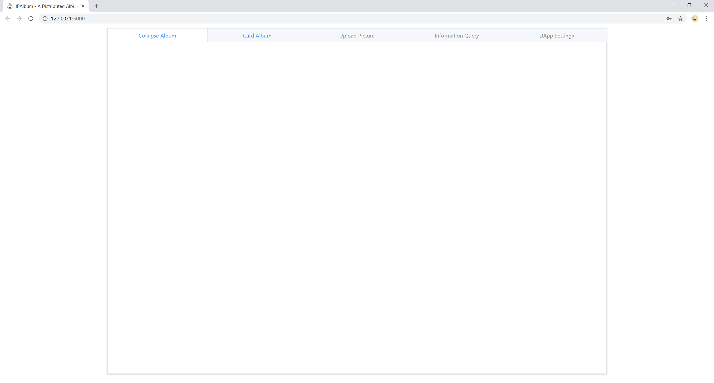


### 5.4. dApp Settings

When you select this tab, you can see the following interface:


- **Select Default Network**

As a tutorial project, we provide an example about how to support different network in a dApp, such as main network, test network and local network.

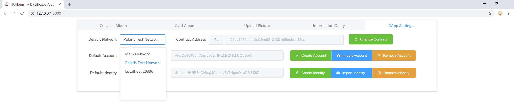

In our tutorial project, if you connect to a new node successfully, you will receive the following message.

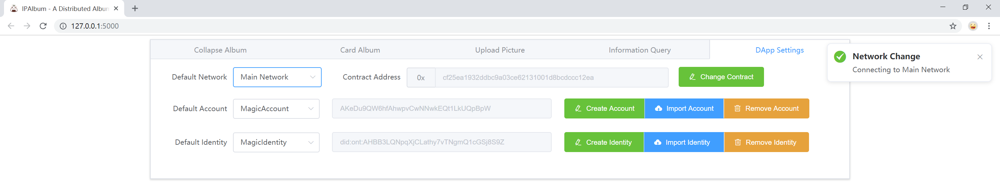

In our tutorial project, if you want to connect to a local node, please make sure you have run it in your computer before you connect, or you will receive the following message.


For more details, you can visit [Ontology](https://github.com/ontio/ontology).

You can also connect your dApp to the solochain.

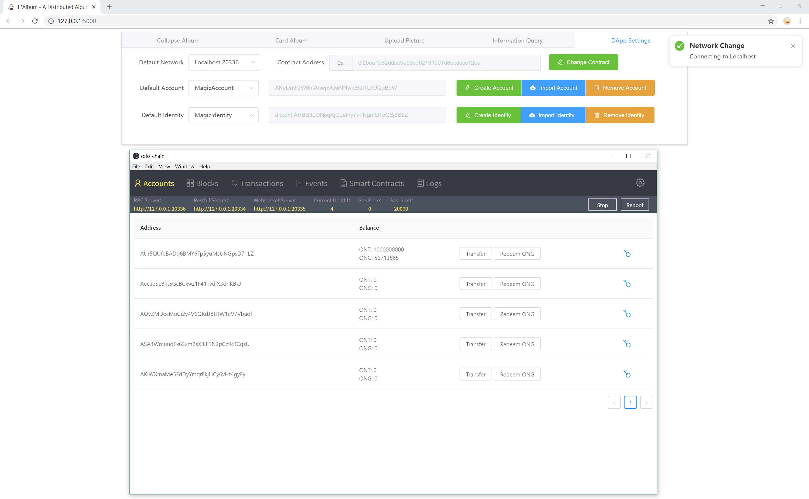

- **Select Default Account**

As a tutorial project, we provide an example about how to support multi wallet account management in a dApp.


In our tutorial project, when the dApp start, it will read the wallet file in your computer, then initialize the wallet account for you.


- **Create Account**

As a tutorial project, we provide an example about how to create new account in a dApp.

In our tutorial project, you **must** input a label for your account, which is a basic way to help your identify different accounts.


Therefore, if you not input a correct label, you will receive the following message.


In our tutorial project, you **must** set a password for your account. This password will used to encrypt and decrypt your account's private key, which is an basic way to protect account's security.


Therefore, if you not input a correct password, you will receive the following message.


If everything goes smoothly, your will get a hexadecimal private key in message box like the following.

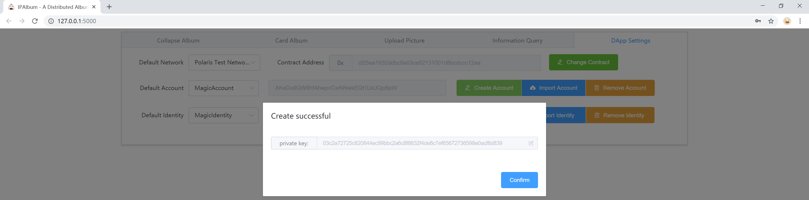

Now, you can switch to your new accout.


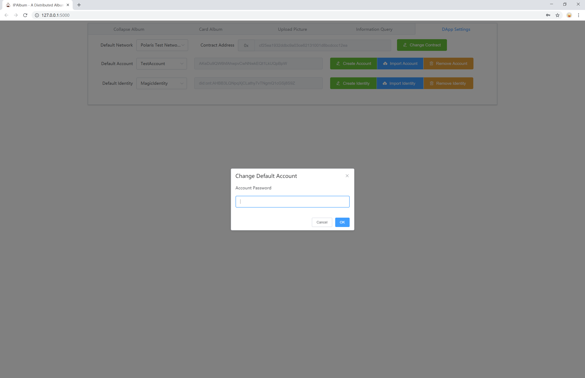

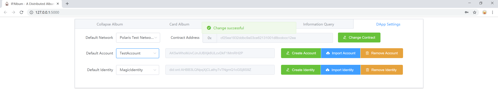

- **Import Account**

As a tutorial project, we provide an example about how to import a account into a dApp  based on hexadecimal private key.

In our tutorial project, you should paste a private key string into the input box.


**NOTE**: The length of your hexadecimal private key should be 64. if you input an error private key, you will get a notify.

In our tutorial project, you **must** input a label for your account, which is a basic way to help your identify different accounts.

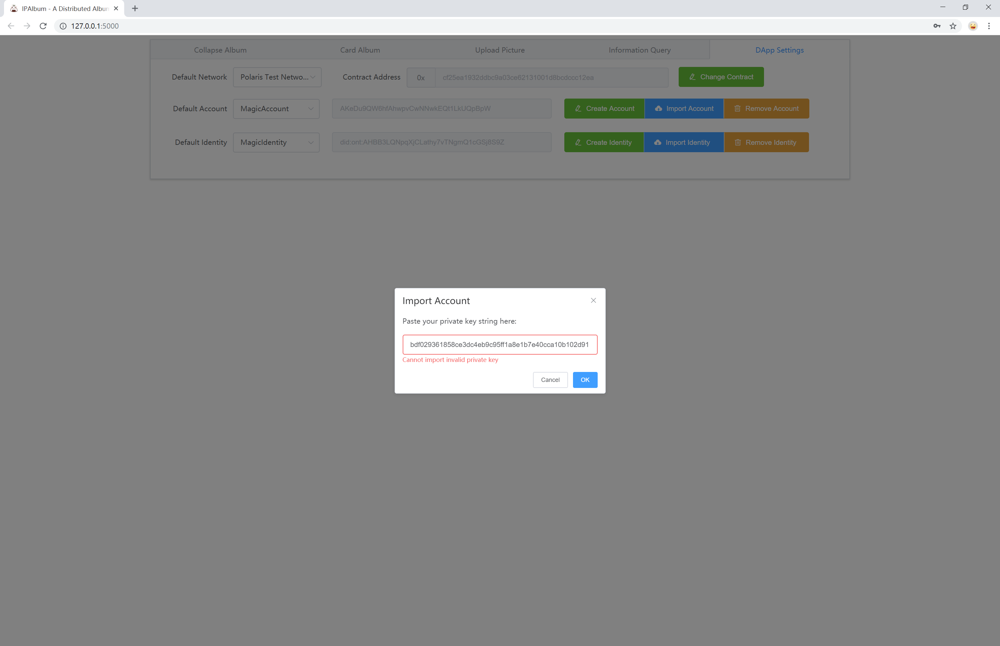

In our tutorial project, you **must** set a password for your account. This password will used to encrypt and decrypt your account's private key, which is an basic way to protect account's security.


In our tutorial project, if you import account by private key successfully, you can see your new account in drop-down menu.


Now, you can get your new account's base58 encode address in the following box.

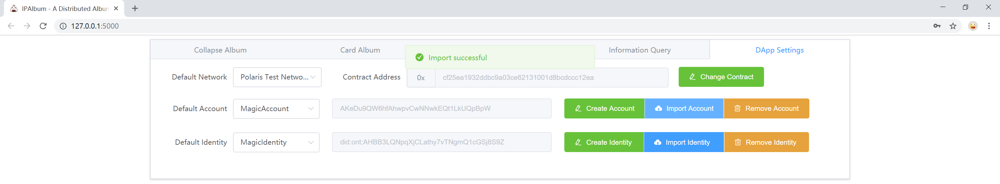

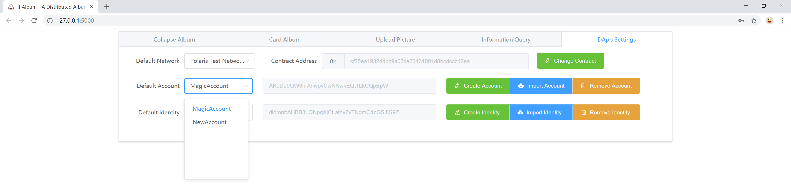


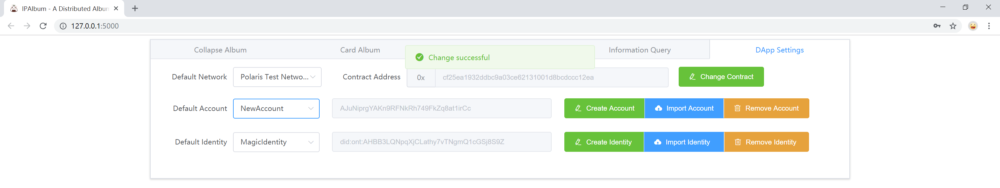

- **Remove Account**

As a tutorial project, we provide an example about how to remove a account from a dApp based on ontology-python-sdk.

In our tutorial project, you should provide a password to provide you have permission to manage this account.


If everything goes smoothly, you will receive the following message.

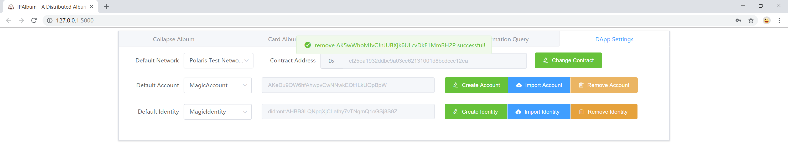

Now, the account is removed from the `Default Accout` drop-down menu and also with the wallet file.

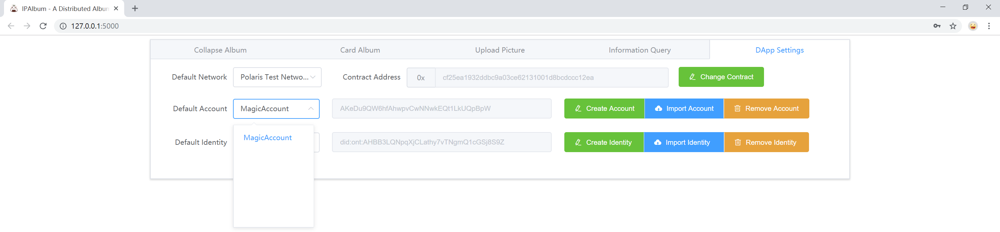