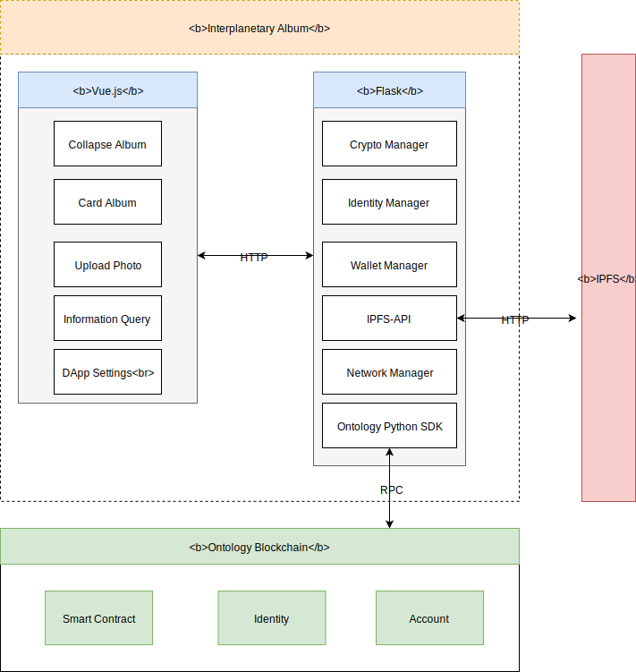
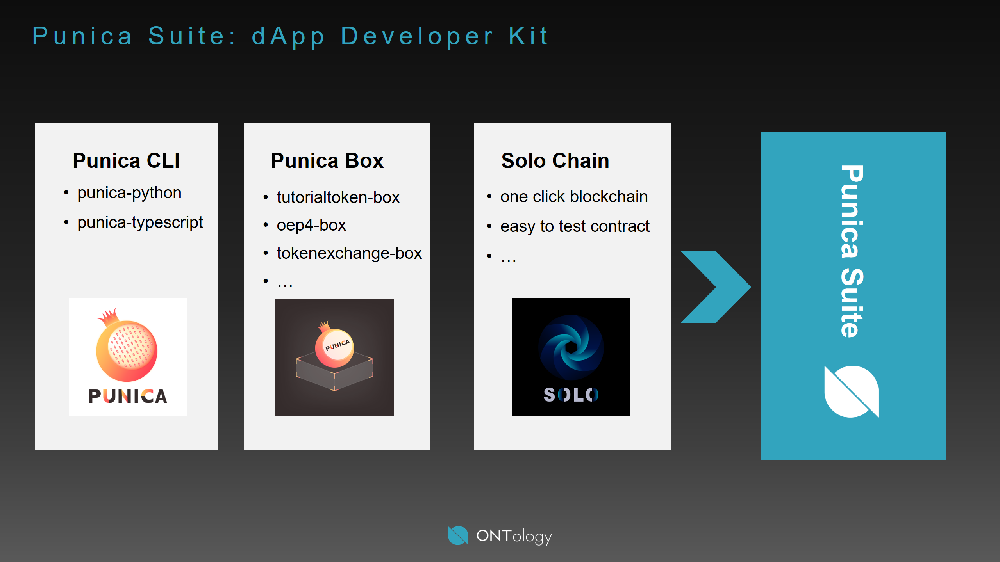
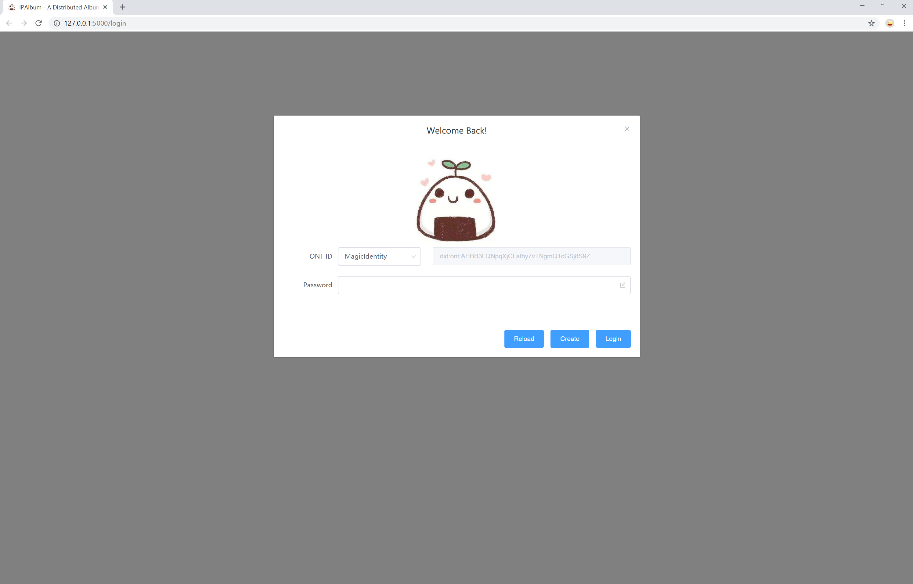
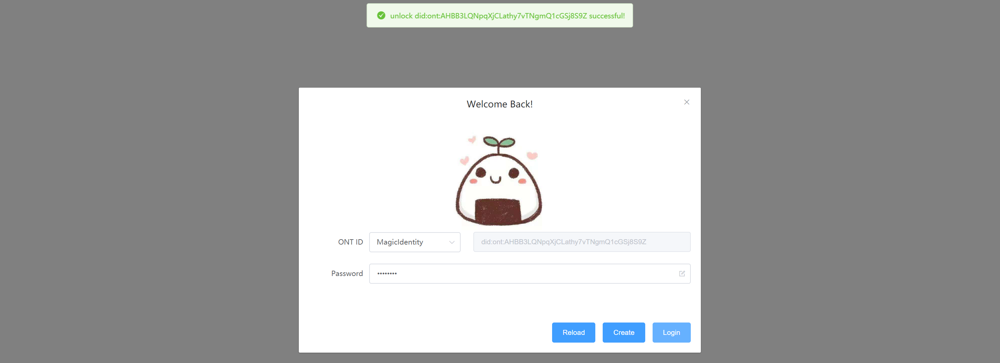
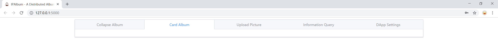
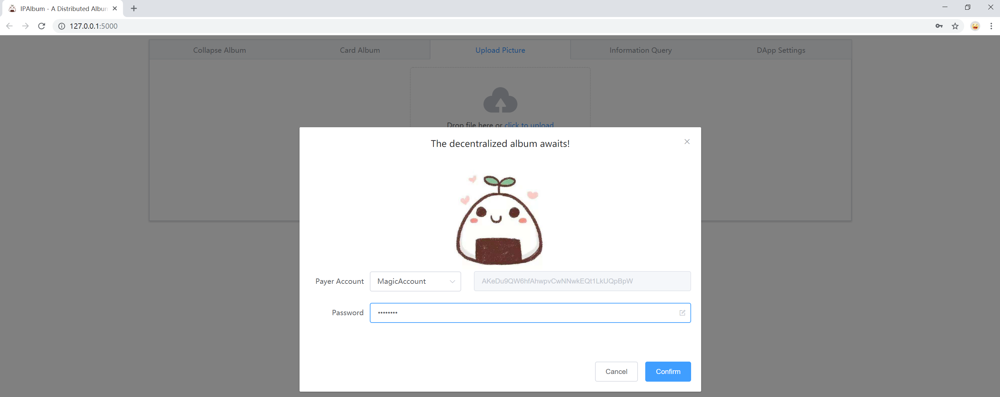
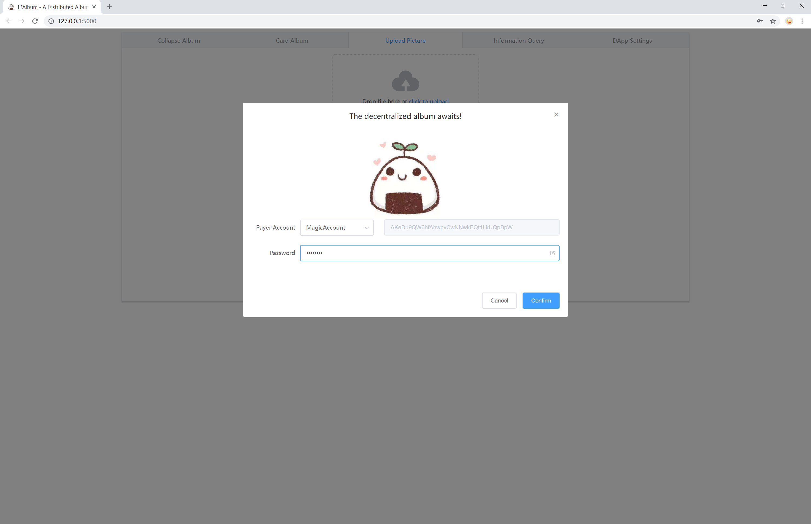
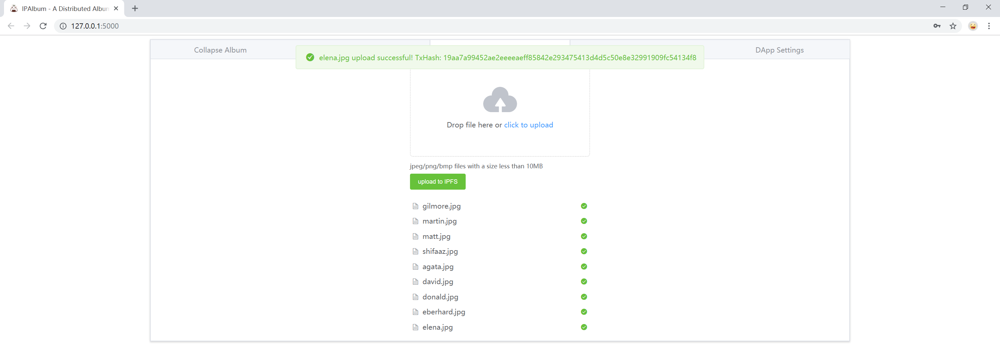
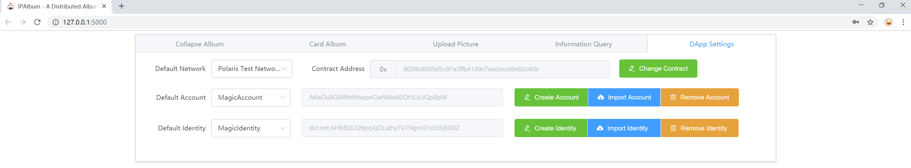

# interplanetary-album-box

Welcome to Interplanetary Album, a decentralized Album is waiting for your.

<!-- TOC -->

- [1. Introduction](#1-introduction)
    - [1.1. How IPFS Works](#11-how-ipfs-works)
    - [1.2. IPFS HTTP API](#12-ipfs-http-api)
- [2. Architecture](#2-architecture)
- [3. Setting up the environment](#3-setting-up-the-environment)
- [4. Getting started](#4-getting-started)
    - [4.1. what's the Punica Suite](#41-whats-the-punica-suite)
    - [4.2. what's the Punica Box](#42-whats-the-punica-box)
    - [4.3. Unboxing the dApp](#43-unboxing-the-dapp)
- [5. Initialize your IPFS Repository](#5-initialize-your-ipfs-repository)
- [6. Run your dApp](#6-run-your-dapp)
- [7. Use your dApp](#7-use-your-dapp)
    - [7.1. Unlock your Identity](#71-unlock-your-identity)
    - [7.2. Enjoy your Photos](#72-enjoy-your-photos)
    - [7.3. Upload your Photos](#73-upload-your-photos)
    - [7.4. dApp Settings](#74-dapp-settings)

<!-- /TOC -->

## 1. Introduction

### 1.1. How IPFS Works

You may be interested about what's the IPFS and how it works.

 when we add files to IPFS:

- Each file and all of the blocks within it are given a unique fingerprint called a cryptographic hash.
- IPFS removes duplications across the network.
- Each network node stores only content it is interested in, and some indexing information that helps figure out who is storing what.
- When looking up files, you're asking the network to find nodes storing the content behind a unique hash.
- Every file can be found by human-readable names using a decentralized naming system called IPNS.

### 1.2. IPFS HTTP API

When an IPFS node is running as a daemon, it exposes an HTTP API that allows you to control the node and run the same commands you can from the command line.

In many cases, using this API this is preferable to embedding IPFS directly in your program — it allows you to maintain peer connections that are longer lived than your app and you can keep a single IPFS node running instead of several if your app can be launched multiple times. In fact, the ipfs CLI commands use this API when operating in online mode.

This API is intended to be the same across different IPFS implementations. However, not all implementations are equally up-to-date. The most feature-complete (and the current reference for this specification) is go-ipfs.

## 2. Architecture

<div align=center></div>

## 3. Setting up the environment

There are a few technical requirements before we start. Please install the following:

- [python 3.7](https://www.python.org/downloads/release/python-370/)
- [git](https://git-scm.com/)
- [go-ipfs](https://dist.ipfs.io/#go-ipfs)

## 4. Getting started

### 4.1. what's the Punica Suite

Punica is a Ontology dApp Development Framework, which has (almost) everything you need for Ontology dApp development.

Now, we have Punica CLI, Punica Box and Solo Chain in our Punica Suite. More powerful dApp development tools is on the road.



### 4.2. what's the Punica Box

In the past, when we wanted to begin developing on Ontology Blockchain, the first question we may ask is, "Where do I start?".

Now, we have a brief answer, “Start from Punica Box.

Punica Box is an example Ontology application and/or boilerplate that puts complimentary tools and libraries into a single, easily-downloadable package. Every Punica Box comes with libraries and tools already preinstalled, code that uses those libraries and tools, external scripts (if necessary), as well as helpful README's and documentation. All Punica Boxes are directly integrated into the OBox command line, and you need only type `punica unbox <box name>` to download and prepare your box of choice.

Before we begin a wonderful journey, ensure you've installed the latest version of OBox before opening your first box.

### 4.3. Unboxing the dApp

Install Punica.

```shell
pip install punica
```

Download the interplanetary-album box.

```shell
punica unbox interplanetary-album
```

Create virtual environments(optional).

```shell
virtualenv --no-site-packages venv
```

If you choose to create a virtual environment, you may need to activate your project's virtual environment.

```shell
.\venv\scripts\activate
```

Install the necessary dependencies.

```shell
pip install -r requirements.txt
```

## 5. Initialize your IPFS Repository

`IPFS` stores all its settings and internal data in a directory called the repository. Before using IPFS for the first time, you’ll need to initialize the repository with the ipfs init command:

```shell
PS C:\Users> ipfs init
initializing IPFS node at C:\Users\.ipfs
generating 2048-bit RSA keypair...done
peer identity: QmbhtBLaPLLUXgon7Quue1JkLjRmoQmm97cqto9JdJ4KuR
to get started, enter:

        ipfs cat /ipfs/QmS4ustL54uo8FzR9455qaxZwuMiUhyvMcX9Ba8nUH4uVv/readme
```

The hash after `peer identity` is your node’s ID and will be different from the one shown in the above output. Other nodes on the network use it to find and connect to you. You can run ipfs id at any time to get it again if you need it.

## 6. Run your dApp

At this point, you can run the dApp in your browser:

```shell
python interplanetary_album.py
```

- If everything goes smoothly, your dApp will run on http://127.0.0.1:5000/, and your IPFS node will run on http://127.0.0.1:5001/.

- If you want to quit it, you can press CTRL+C or close the terminal.



## 7. Use your dApp

### 7.1. Unlock your Identity

In our interplanetary-album, all pictures's IPFS address are bind with [Ontology digital identification](https://ontio.github.io/documentation/ontology_DID_en.html)（also `ONT ID`), which is a decentralized identification protocol which based on W3C DID specifications, and encrypted by it's public key in elliptic curve integrated encryption scheme(also ECIES). That is to say, only the picture owner and the user he shared with can visit his picture in the IPFS Network.



### 7.2. Enjoy your Photos


### 7.3. Upload your Photos










### 7.4. dApp Settings

